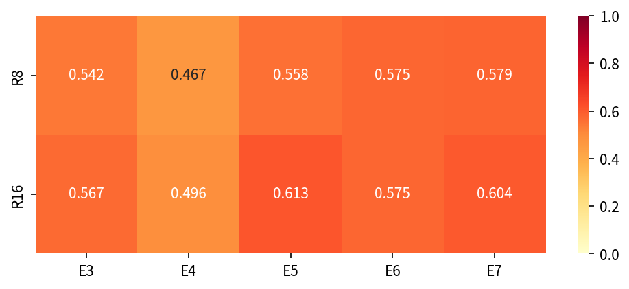
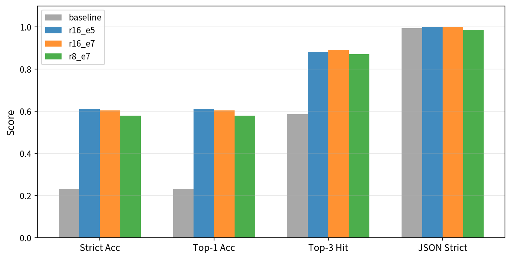
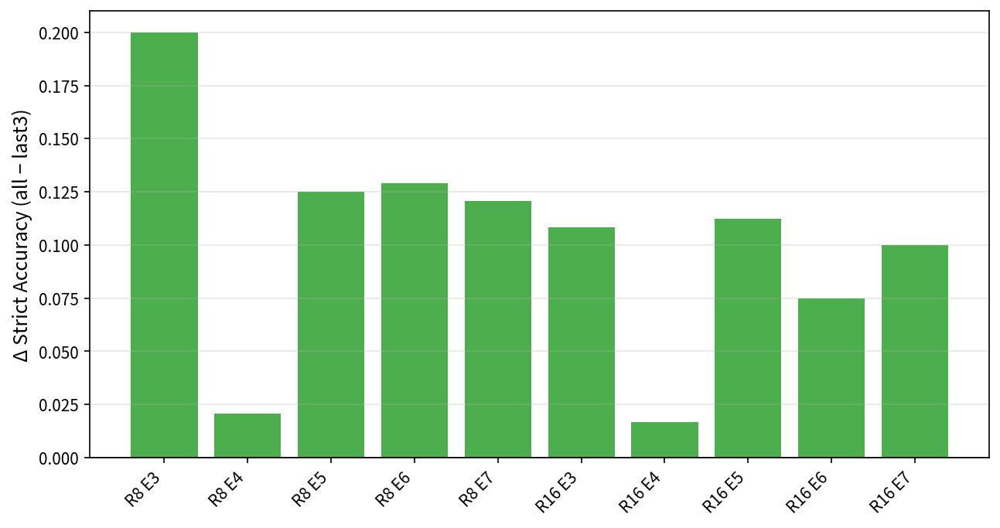

<p align="center">
  
</p>

# ruozhiba-qwen-lora

> 基于 **弱智吧** 语料，用 **LoRA** 微调 **Qwen3-4B-Instruct**，完成 8 类幽默结构化分类（`thought_process` + top-3 类别与置信度）。

---

## 概览

1. **数据**：贴吧年度帖 / GitHub 语料 / Hugging Face CQIA，去重与分类后构建 ShareGPT 训练集。  
2. **训练**：LLaMA-Factory，LoRA rank 8/16，全量与近三年子集，多 epoch。  
3. **评估**：CQIA  hold-out 上 Strict Accuracy、Top-3、JSON 可解析率；混淆矩阵与热力图等。

**8 类幽默**（示例）：古典弱智、奇怪提问、弱智科学家、人生态度、文字游戏、地狱笑话、谐音梗、文艺弱智 — 定义与 prompt 见 `configs/prompts.yaml`。

---

## 文档（详细见 [`doc/](doc/readme.md)）

| 说明 | 链接 |
|------|------|
| 环境安装与依赖 | [doc/guides/environment.md](doc/guides/environment.md) |
| 数据来源与格式 | [doc/guides/data.md](doc/guides/data.md) |
| 复现步骤（含流水线图） | [doc/guides/reproduction.md](doc/guides/reproduction.md) |
| 训练/指标摘要 | [doc/guides/results_summary.md](doc/guides/results_summary.md) |
| **完整文档索引** | [doc/readme.md](doc/readme.md) |

英文实验报告（含嵌入图）：[doc/report/lab3_report.md](doc/report/lab3_report.md)。LaTeX 版源文件位于 `doc/report/lab3_report_latex/`，可直接编译 `main.tex` 生成 PDF 报告。

---

## 实验结果

| Rank×Epoch 热力图（Strict Acc） | Strict Accuracy 随 epoch |
|:--:|:--:|
|  |  |

| Baseline vs Top-3 模型 | 全量 vs 近三年 |
|:--:|:--:|
|  |  |

训练过程图现已补全：`results/charts/line_training_loss.pdf` 给出 step-level training loss，`results/charts/grid_train_eval_loss.pdf` 给出四组实验的 train/eval loss 对照，满足 assignment 对 `Training loss over steps` 的要求。原始提取结果同步保存在 `results/training/r8_loss_curves.json`、`results/training/r16_loss_curves.json`、`results/training/r8_last3_loss_curves.json`、`results/training/r16_last3_loss_curves.json`。

---

## 快速复现（极简）

```bash
uv venv env_sft --python 3.12 && source env_sft/bin/activate
uv pip install 'llamafactory[metrics]' accelerate vllm json-repair seaborn matplotlib pyyaml openai tenacity tqdm python-dotenv
# 数据 → LLaMA-Factory、训练、合并、推理、评估：见 doc/guides/reproduction.md
```

若需直接复用已训练出的 loss 曲线与可视化产物，可查看 `results/training/`（由 `LLaMA-Factory/saves/qwen3-4b/lora/*/trainer_log.jsonl` 提取）以及 `results/charts/line_training_loss.pdf`、`results/charts/grid_train_eval_loss.pdf`。

最小可运行提交包说明：[upload/readme.md](upload/readme.md)。`upload/scripts/` 与主仓库在保留的核心子目录上保持同构，当前覆盖 `data/`、`train/`、`inference/`、`viz/` 四类核心脚本；不包含 `scripts/tests/` 调试脚本，但 `upload/scripts/viz/` 需要与主仓库 `scripts/viz/` 的保留可视化能力同步维护。

---

## 仓库结构（精简）

```
.
├── readme.md
├── configs/           # 训练 / prompt / merge 配置
├── scripts/           # 分阶段脚本：crawl/ data/ train/ inference/ viz/ tests/（其中 tests/ 为调试脚本；见 scripts/readme.md）
├── data/              # 语料、测试集与 LLaMA-Factory 数据副本说明见 data/readme.md
├── doc/               # 入口 doc/readme.md；guides/ analysis/ course/ report/ proposal/ 与 LaTeX 报告源
├── LLaMA-Factory/
├── models/            # 基座与 merged（若已生成）
├── results/           # 推理、评估、图表与 training loss 提取结果
├── media/             # 项目 Logo 等资源
└── upload/            # 最小提交包
```

更完整的树与字段说明见 **[doc/guides/data.md](doc/guides/data.md)**、[`scripts/readme.md`](scripts/readme.md)、[`configs/readme.md`](configs/readme.md) 与历史版结构说明（如需可查阅 `doc/course/changelog.md`）。
