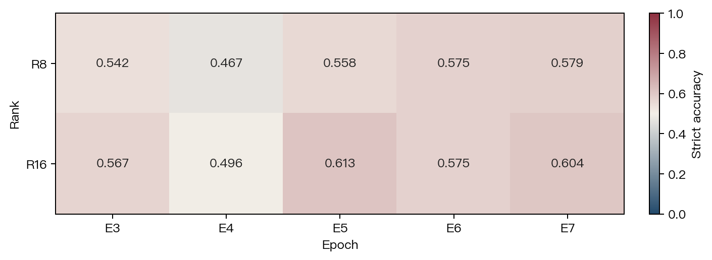
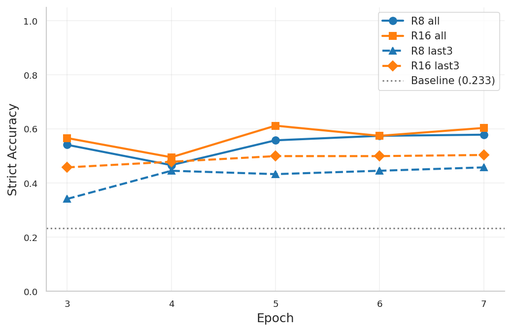
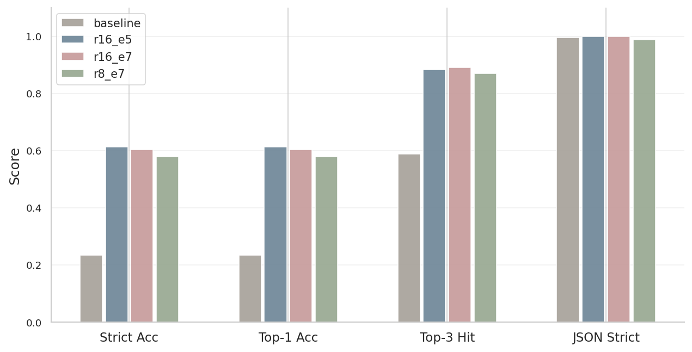
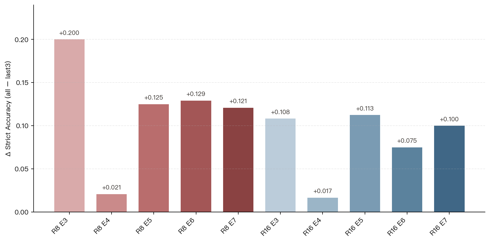

# Ruozhiba Humor Classification SFT

> Minimal, self-contained package for reproducing the LoRA SFT experiment on Qwen3-4B-Instruct.

---

## Prerequisites

- Python 3.12 + CUDA 12.x
- NVIDIA GPU (≥ 24 GB VRAM for inference)
- Base model: [Qwen3-4B-Instruct-2507](https://huggingface.co/Qwen/Qwen3-4B-Instruct-2507) should be downloaded and saved in `model/` path

---

## Environment Setup

```bash
uv venv env_sft python 3.12
source env_sft/bin/activate
git clone https://github.com/hiyouga/LlamaFactory
cd LLaMA-Factory
uv pip install -e .  # Install LLaMA-Factory in editable mode
uv pip install accelerate
uv pip install vllm json-repair seaborn matplotlib pyyaml numpy transformers torch
```

---

## Reproduction Steps

> 同级存在 `LLaMA-Factory/`、`models/`、`env_sft/`。

### 1. Prepare LLaMA-Factory Data

Copy training data and dataset registry into LLaMA-Factory's data directory:

```bash
cp data/ruozhiba_all.json    LLaMA-Factory/data/
cp data/ruozhiba_last3.json  LLaMA-Factory/data/
cp data/dataset_info.json    LLaMA-Factory/data/
```

> **Note**: If you already have a `dataset_info.json`, merge the two `ruozhiba_*` entries from `data/dataset_info.json` into it instead of overwriting.

### 2. LoRA Fine-Tuning

```bash
# Full dataset — dual GPU parallel (two tmux panes)
bash scripts/train/run_training.sh 0 8
bash scripts/train/run_training.sh 1 16

# Last-3-year dataset
bash scripts/train/run_training.sh 0 8  configs/qwen3_4b_base_last3.yaml last3
bash scripts/train/run_training.sh 1 16 configs/qwen3_4b_base_last3.yaml last3
```

### 3. Merge LoRA Weights

```bash
bash scripts/train/batch_merge.sh
```

This merges 20 LoRA checkpoints (4 experiments × epochs 3–7) into `models/merged/`.

### 4. Batch Inference

```bash
bash scripts/inference/batch_inference.sh 0   # GPU 0
```

Runs greedy-decoding inference on 240 CQIA test samples for all 21 models (baseline + 20 merged).  
默认将 `results/results_*.json` 写入**仓库根**的 `results/`（与主仓库 `scripts/inference/` 行为对齐）。

### 5. Evaluation + Visualization

```bash
python scripts/viz/eval_metrics.py \
    --results_dir results/ \
    --gold data/ruozhiba_cqia_classified_v2.json \
    --comparison
```

Generates:

- `results/json/eval_*.json` — per-model metrics
- `results/json/eval_comparison.json` — cross-model comparison
- `results/confusion_matrices/` — confusion matrix plots
- `results/heatmaps/` — rank × epoch heatmaps
- `results/charts/` — trend & comparison charts
- `results/training/` — extracted step-level training / validation loss summaries from `trainer_log.jsonl`

If you also want the report-facing figure bundle refreshed:

```bash
python scripts/viz/update_report_media.py
```

### 6. Before/After Comparison

```bash
python scripts/viz/gen_before_after.py

# Optional: override comparison inputs
python scripts/viz/gen_before_after.py \
    --baseline results/results_baseline.json \
    --candidate results/results_r16_e5.json \
    --output results/before_after_samples.json
```

---

## Key Results

| Rank×Epoch Heatmap (Strict Acc) | Strict Accuracy by Epoch |
|:--:|:--:|
|  |  |

| Baseline vs Top-3 Model | Full Data vs Last-3-Year |
|:--:|:--:|
|  |  |

| Metric | Baseline | Best (r16_e5) | Improvement |
|--------|----------|---------------|-------------|
| Strict Accuracy | 0.233 | **0.613** | +163% |
| Top-3 Hit Rate | 0.588 | **0.883** | +50% |
| JSON Strict Parse | 0.996 | **1.000** | — |
| Valid Sample Rate | 1.000 | 1.000 | — |

Best model: **R16, full data, epoch 5** (eval_loss = 0.8859).

---

## Directory Structure

```text
├── readme.md                              # This file
├── link.md                                # File provenance (where each file comes from)
├── media/
│   ├── heatmap_all_strict_accuracy.png    # Strict accuracy heatmap used in this README
│   ├── line_strict_accuracy.png           # Strict accuracy trend chart used in this README
│   ├── bar_baseline_vs_top3.png           # Baseline vs best model comparison chart
│   └── bar_all_vs_last3_delta.png         # Full-data vs last-3-year comparison chart
├── configs/
│   ├── prompts.yaml                       # Centralized system prompt + 8 humor categories
│   ├── qwen3_4b_base.yaml                # Training config — full dataset (2,785 samples)
│   ├── qwen3_4b_base_last3.yaml          # Training config — last-3-year dataset (1,025 samples)
│   └── qwen3_4b_merge.yaml               # LoRA merge config template
├── scripts/
│   ├── data/
│   │   └── build_sft_data.py              # Build ShareGPT training data (needs full data/tieba/)
│   ├── train/
│   │   ├── run_training.sh                # Launch LoRA SFT training (per-GPU)
│   │   └── batch_merge.sh                 # Merge 20 LoRA checkpoints → models/merged/
│   ├── inference/
│   │   ├── inference_eval.py              # vLLM offline batch inference
│   │   └── batch_inference.sh             # Run inference across 21 models
│   └── viz/
│       ├── eval_metrics.py                # Two-stage evaluation + visualization
│       ├── gen_before_after.py            # Before/after comparison samples (CLI inputs supported)
│       └── update_report_media.py         # Sync selected figures into LaTeX report media/
├── data/
│   ├── ruozhiba_all.json                  # Full training set (2,785 ShareGPT conversations)
│   ├── ruozhiba_last3.json                # Last-3-year training set (1,025 conversations)
│   ├── ruozhiba_cqia_classified_v2.json   # Test set (240 CQIA samples with gold labels)
│   └── dataset_info.json                  # LLaMA-Factory dataset registry (ruozhiba only)
└── results/
    ├── eval_comparison.json               # 21-model evaluation comparison table
    ├── before_after_samples.json          # 5 representative before/after examples
    ├── r8_loss_curves.json                # Training/eval loss curves for r8 (all)
    ├── r16_loss_curves.json               # Training/eval loss curves for r16 (all)
    ├── r8_last3_loss_curves.json          # Training/eval loss curves for r8_last3
    └── r16_last3_loss_curves.json         # Training/eval loss curves for r16_last3
```
